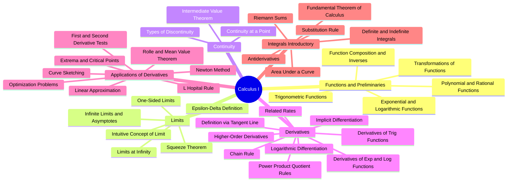

# 📘 Calculus I — Complete Syllabus & Study Guide

> A comprehensive reference syllabus for **Calculus I**, based on the curricula of top-ranked universities worldwide (MIT, Stanford, Harvard, Caltech, CMU, Oxford, Cambridge), tailored for **Computer Science & Engineering** students.

---

## 📑 Table of Contents

- [Overview](#-overview)
- [Mind Map](#-mind-map)
- [Full Syllabus](#-full-syllabus)
  1. [Functions & Preliminaries](#1-functions--preliminaries)
  2. [Limits](#2-limits)
  3. [Continuity](#3-continuity)
  4. [Derivatives](#4-derivatives)
  5. [Applications of Derivatives](#5-applications-of-derivatives)
  6. [Integrals (Introductory)](#6-integrals-introductory)
- [Recommended Reference Books](#-recommended-reference-books)
- [Why This Matters for Computer Science](#-why-this-matters-for-computer-science)
- [Notes](#-notes)
- [License](#-license)

---

## 🧭 Overview

Calculus I is the foundational mathematics course covering **limits, continuity, differentiation, and an introduction to integration**. It is a mandatory prerequisite in nearly every Computer Science, Engineering, and Physical Sciences program at leading universities.

| Property | Detail |
|---|---|
| Typical Duration | 1 semester (12–16 weeks) |
| Prerequisite | Precalculus / Algebra & Trigonometry |
| Leads To | Calculus II, Linear Algebra, Differential Equations |
| Relevance to CS | Optimization, Machine Learning, Algorithm Analysis, Graphics |

---

## 🗺 Mind Map

> 💡 GitHub natively renders Mermaid diagrams inside `.md` files — no extra setup needed.

---

## 📚 Full Syllabus

### 1. Functions & Preliminaries
- Polynomial, rational, and radical functions
- Trigonometric functions and their inverses
- Exponential and logarithmic functions
- Function composition and inverse functions
- Transformations (shifts, reflections, scaling)

### 2. Limits
- Intuitive concept of a limit
- Algebraic techniques for evaluating limits
- One-sided limits (left-hand / right-hand)
- Limits at infinity
- Infinite limits and asymptotic behavior
- Squeeze (Sandwich) Theorem
- Formal epsilon-delta definition of a limit

### 3. Continuity
- Continuity at a point and over an interval
- Types of discontinuities (removable, jump, infinite)
- Intermediate Value Theorem (IVT)

### 4. Derivatives
- Definition of the derivative (instantaneous rate of change, tangent line)
- Differentiability and its relation to continuity
- Differentiation rules: power, product, quotient
- Chain rule
- Derivatives of trigonometric functions
- Derivatives of exponential and logarithmic functions
- Implicit differentiation
- Logarithmic differentiation
- Higher-order derivatives
- Related rates problems

### 5. Applications of Derivatives
- Extrema (maxima/minima) and critical points
- Rolle's Theorem and the Mean Value Theorem
- First and second derivative tests (increasing/decreasing, concavity)
- Curve sketching
- Optimization problems
- Linear approximation and differentials
- L'Hôpital's Rule
- Newton's Method (in select curricula)

### 6. Integrals (Introductory)
- Antiderivatives
- Definite and indefinite integrals
- Riemann sums
- Fundamental Theorem of Calculus (Parts I & II)
- Substitution rule
- Basic applications (area under a curve)

> 📌 **Note:** Some universities (e.g., MIT's 18.01) cover integrals extensively within Calculus I, while others (common in many European programs) defer integration entirely to Calculus II.

---

## 📖 Recommended Reference Books

| Book | Author | Used By | Level |
|---|---|---|---|
| *Calculus: Early Transcendentals* | James Stewart | Most US & international universities | Applied / Engineering |
| *Thomas' Calculus* | George B. Thomas | MIT (18.01/18.02) | Applied / Engineering |
| *Calculus* | Michael Spivak | Harvard, Princeton | Pure Math / Proof-based |
| *Calculus, Vol. 1 & 2* | Tom M. Apostol | Caltech | Pure Math / Axiomatic |
| *Calculus* | Ron Larson | Many US universities | Applied |
| *Calculus* (MIT OpenCourseWare, free) | Gilbert Strang | MIT (open access) | Applied / Free |

**Recommendation for Computer Science students:** *Stewart* or *Thomas* — both are the standard choice at Stanford, Berkeley, and CMU.

---

## 💻 Why This Matters for Computer Science

| Calculus Topic | CS Application |
|---|---|
| Derivatives & Optimization | Gradient Descent, Machine Learning training |
| Limits & Continuity | Algorithm behavior, numerical stability |
| Integrals | Probability distributions, statistics |
| Chain Rule | Backpropagation in Neural Networks |
| Linear Approximation | Numerical methods, error estimation |

---

## 📝 Notes

- This syllabus is a **general reference**, compiled from common curricula across top-ranked universities. Actual course content may vary by institution.
- Depth of coverage (e.g., proof-based vs. applied) differs significantly between pure mathematics programs and engineering/CS programs.
- Contributions and corrections are welcome — feel free to open a Pull Request.

---

## 📄 License

This document is released under the [MIT License](https://opensource.org/licenses/MIT) — free to use, share, and modify.

---

Made with 📐 for students pursuing Computer Science & Engineering

